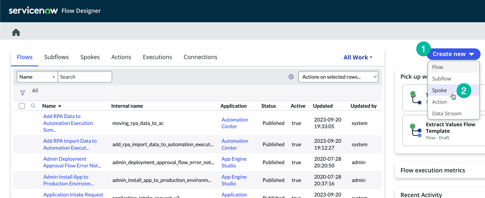
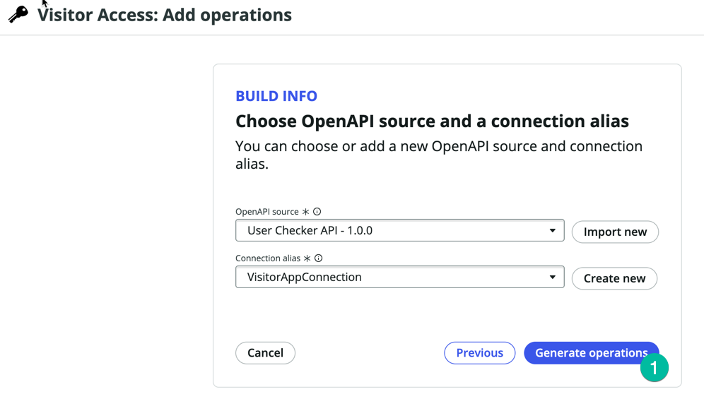
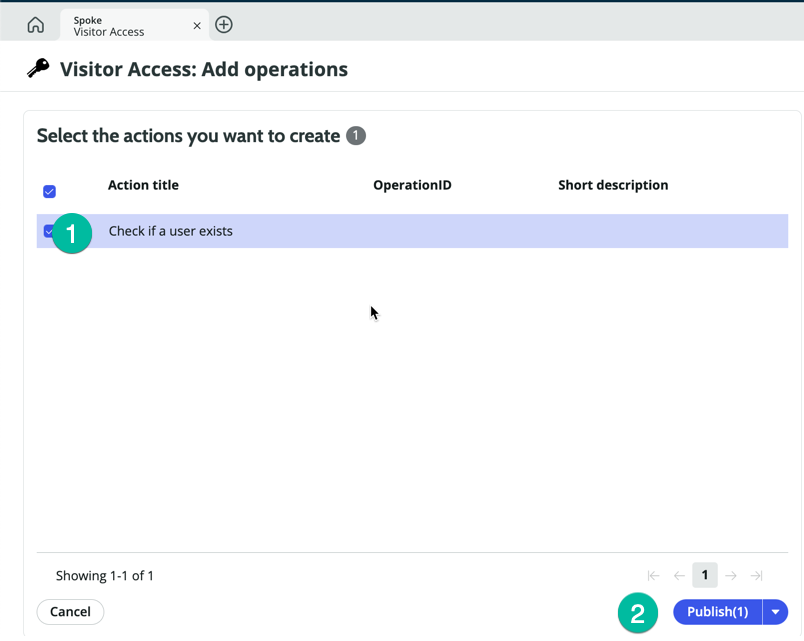
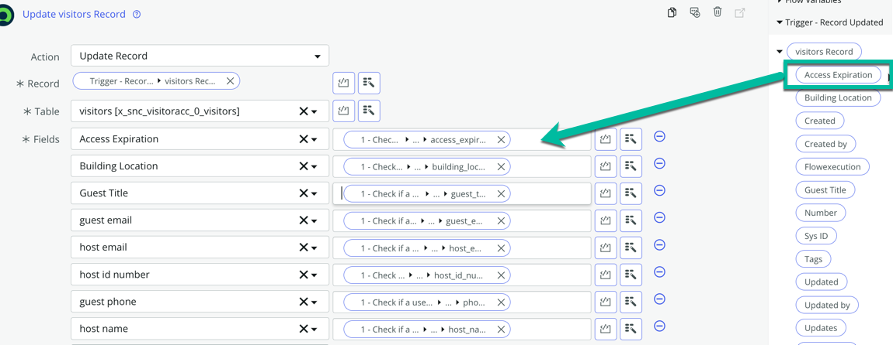
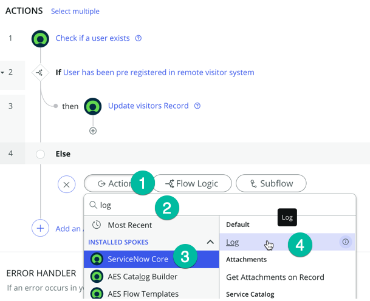
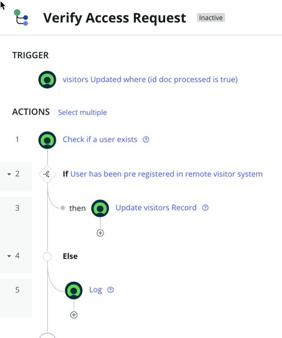

# Integration Hub Lab

## Introduction

IntegrationHub is the central place on the platform for consuming, creating, and managing integrations on your ServiceNow instance. In the event that you are seeking to connect a workflow to an external system, but ServiceNow or ServiceNow technology partners do not offer an out-of-the-box integration (Spoke) for it, you can easily create your own. IntegrationHub provides numerous Action Steps to connect your workflow to external systems that use protocols such as REST, PowerShell, SSH, etc. In this lab, we will focus on REST integration.

## Goal 

In this lab, we will highlight the new 'Spoke Generator' capability. This feature allows you to create new spokes and spoke actions for third-party APIs that comply with the OpenAPI specification. You will utilize a provided YAML file. 
   > A YAML file for OpenAPI specs is a human-readable configuration file that defines the structure, endpoints, and details of a RESTful API, making it easier for developers to document and communicate the API's design. The spoke generator can automatically leverage this YAML file to create spoke actions.
   
This new feature "Spoke Generator" accelerates the time it takes to create a new integration.

## Use case

ACME Inc. is using a third-party system to manage visitor access and authorization to their buildings. This system is managed by a Security and Property Management company. ACME Inc. would like to improve the experience for visitors and their employees. ACME Inc. uses ServiceNow and would like to automate the process of verifying visitor access and badge printing using ServiceNow workflows. ACME inc. has created a modern experience using the ServiceNow platform, visitors can self check in via a kiosk at the reception of each buildings.

However,there are no out-of-the-box integrations available for that Visitor Access application that is hosted and managed outside of the ServiceNow Platform. As a ServiceNow builder, we need to create that integration (Spoke) so that we can query this remote system from a workflow that will be triggered when visitor checks in at the kiosk

In this scenario, you had a meeting with the administrator of the third-party visitor access app, who has provided you with the following API documentation: [API Documentation Link](https://quentincloudsnow.github.io/userlookup/#/default/get_checkUser). You can open the link to understand how that API works.

This is a fairly simple API. As you can see, there is only one API method, 'checkUser,' and that method requires three inputs."

| Field | type |
   |-------|-------|
   | firstname | string |
   | lastname | string |
   | dateofbirth | YYY-MM-DD |
   

By passing those user information, the API will return a message stating if a user exist or not, if the user exist, it will return additonal information that you need to use in a ServiceNow workflow, see the example of response returned by the API

 
      {
      "code": "0",
      "message": "User exists",
      "user": {
         "guest_title": "Guest",
         "phone": "123-456-7890",
         "host_name": "Jane Smith",
         "host_id_number": "987654",
         "host_email": "jane@example.com",
         "guest_email": "john@example.com",
         "building_location": "Building A",
         "access_expiration": "2023-12-31"
               }
      }

In the JSON response, you will receive a 'code' indicating success (0), a 'message' stating that the user exists, and detailed 'user' information including guest title, phone number, host name, host ID number, email addresses, building location, and access expiration date. If the user does not exist you will receive a code 1. In our scenario, the user data we get from the response will be used to Print a badge for the visitor. (the Badge printing process is covered in another lab with our RPA Hub technology)

## Creating the spoke

Log in to your instance, then, on the main page, click **All** (1). Next, type **flow** (2) and click **Flow Designer** (3) to open the Flow Designer UI.

Once you are in the **Flow Designer** UI, to access the Spoke Generator, select **Create New** (1) (located on the right-hand side of the screen), and then click on **Spoke**.

The Spoke Generator prompts you for a thumbnail Image (1)  (You can upload a thumbnail image to be your Spoke logo (feel free to find a free image on google image and upload it here), Spoke Name (2) and a Description (4)

| Field | Value |
   |-------|-------|
   | Spoke Name | Visitor Access |
   | App Scope Name | This field is generated automatically from the Spoke Name |
   | Description | This spoke will be used to verify if visitor has been registered in the Visitor Access app |

Once you have set the value, click Create and Continue (1) as shown below:

   

On the next screen, you will be prompted to choose the method you want to use to create your new spoke. We want to use the OpenAPI Specification method since we have been provided with the YAML File that describes the API and complies with the OPENAPI Specification.

Select **OpenAPI Specification** (1) then click **Continue** (2)

On the next screen, **Visitor Access: Add operations**, this is where you can provide the YAML file. Click **Import New** (1), and then provide the url to the  YAML file, copy URL from the link here [Swagger YAML File](https://quentincloudsnow.github.io/userlookup/swagger.yaml).

Paste the URL copied in your clipboard in the previous step, then paste it in the **OpenAPI URL** field (1), then click **Import** (2) 

Once the import is done you should see someting similar to this 

Then click on **Create New** next to the **Connection Alias field** (1) 

> In ServiceNow, a Connection Alias is a configuration setting used to define and manage external system connections. It serves as an abstraction layer for connecting to external systems and simplifies the process of integrating with those systems within ServiceNow workflows and other components. Typically when your connect ServiceNow to an external system, you need to configure the URL of the end-point (3rd party system) and how to authenticate with it. We do this using Connection and Credentials in ServiceNow, In real life obviously a conversation with the admin of the remote system needs to happen and also with the security team before starting to configure this.

In the **Connection alias name** (1) type **VisitorAppConnection** and keep the **Authentication Configuration Template** with the default value **Api Key Template** (2), then click **Create** (3)

Click **Generate operation** (1) 

The system will then prompt you to select which Spoke Action you want to create as shown below

> For this lab, we are using a very simple API created specifically for lab and learning purpose. This API has only one method, which is why only one action is displayed. In reality, most commercial applications you attempt to integrate will have tens or even hundreds of methods in their API. You will be able to select the methods you want to leverage from ServiceNow and create Spoke Actions for them.

Select the ** Check if a user exists** (1) Action then click **Publish** (2)

> Note that if you have the choice to save it as draft, which is probably what we should do in real life instead of publishing the action right away and make it available to flow developer... in the lab we just publish it right away: 

> the screenshot above is just to show you that you can Save as Draft, do not click **Save Actions as Draft**

Click the newly created Spoke Action **Check if a user exists** (1) this will open the Action editor in Flow designer so we can inspect it 

Notice the Action Input section, the Inputs for that Spoke action was created automatically 

Click the OpenAPI Step (1) 

Notice the step inputs, they are using the Action inputs, so the values from the Action Inputs will be passed as parameters when the API Call is made to the external system.

We need to update the Connection Alias in the Connection Details section. We have precreated in this lab instance a Connection record that point to the right API End point. We are going to use this one. 

Click on the **Connection Alias field** (1) then select **VisitorAccess_ConnectionAlias** (2) 

Notice the **Base URL** field was updated and displays the URL for the API End point. Those connection alias records are tyipically managed  a by Security team or user with higher privileges.

On the right hand-side notice the outputs available from the OpenAPI Step, expand the **user** (1) section as shown below:

Those are all the values that we can retrieve from the external app and use in a ServiceNow Workflow.

It's time to test that Spoke Action! Click on the **Test** button 

You will be prompted to enter some user information, **dateofbirth** (1), **firstname** (2), **lastname** (3) please use those values below

| Field | Value |
   |-------|-------|
   | dateofbirth | 1984-01-25|
   | firstname | Ashley |
   | lastname | Burney |

Then click **Run Test** (4)

>Note: Typically those values will be passed to the action via a Workflow. we are just testing the action manually right now.

Once the Action has been executed, click on **Your test has finished running. View the Action execution details** (1) to inspect the response we have received from the external system.

On the **Execution Details** page, scroll down until you see the **ouput Data** section
and click on the output detail (1)

You should see a screen similar to this. Notice the response returned by the API. It contains the return code, message and additional user information. Our new Spoke Action works!

Now let's use from a flow! 

Click on the Home button to return to the main page of flow designer

In the following steps, we just want to show a builder can consume/use the new Spoke Action that we have created. 

Click on **Create New** (1) then **Subflow** (2)

Enter a **Subflow name** (put the name you want) and click **submit** (leave all other field with default values)

> Note: Typically a builder would create a new flow or subflow in his own Application Scope, but for a quick test in a lab instance it doesn't matter we can save it in the Global scope.

A new tab will open for your new subflow, under **ACTIONS** Click **Add an Action, Flow Logic or Subflow** (1)

Select Action then type **Visit**, this should display your new spoke **Visitor Access** (2), click on it then click the action **Check if a useer exists** (3)

Now we can pass the value to the action, here we are going to hardcode values just for test purposes, typically we would lookup a record in ServiceNow and pass values from that record to the action. We will cover that in detail in the optional section of the lab.

| Field | Value |
   |-------|-------|
   | dateofbirth | 1984-01-25|
   | firstname | Ashley |
   | lastname | Burney |

Using the values from the table above, set the **dateofbirth** (1). **firstname** (2). **lastname** (3) then click **Done** (4) and click the **Test** button.

then click **Run Test** (1) 

Click **Your Test has finished running, View the subflow exectution details** 

We have seen in this lab how to create a new Spoke using the spoke generator, to integrate ServiceNow with an external application that has an API we can use.  In the optional section of this lab we are going to cover some more advanced concepts of flow designer/Ihub and use the value retrieved from the spoke action to update a record in ServiceNow.

> Note: With the spoke generator you no longer need to configure the REST Step and JSON Parser Step manually, the spoke action generated with Spoke Generator does that for you automatically

# Optional section

## Introduction

Dealing with integration is often time not as easy as this lab make it sound. In this scenario we are passing data to an API. 
The API is expecting the data to be in a certain format. In this optional lab we are going to see how you can appply data transformation in Flow Designer before passing the data to the external API.

On your instance, click on the **All** menu (1) and in the filter navigator (2) type the x_snc_visitoracc_0_visitors_list.do and press enter to open that custom table.

In this use case, a custom table is utilized by a ServiceNow app developed by ACME Inc. When a visitor checks in at the reception of their building, they can scan their government ID. Using our DocIntel capability, a new record is created in that table for the visitor. Information such as the First Name, Last Name, and Date of Birth of the visitor is then extracted from their government id and stored in that table. In the following section, we will focus on creating the workflow that will take this data, transform it, and use it with the new spoke we created earlier in this lab.

Notice the Visitor First Name and Visitor Last Name values (1); they are in uppercase. Then, notice the Date of Birth (2); it is in the MM/DD/YYYY format.

The external API for which we created a new spoke action earlier won't recognize those values in that format. The API is expecting this format Firstname, Lastname and a date in that format YYYY-MM-DD.

Let's create the workflow that is gonna query that API to validate that the user has all the authorization to access the building, we are going to use Data Tranform and use our new Spoke Action for this.

Open Flow Designer 

Click **Create new** (1) then **Flow** (2)

Type the value **Verify Access Request** on the  **Flow Name** field (1) then click **Submit** (2)

If you get this message, click **Skip tour** 

Click **Add a trigger** (1) to set the condition to trigger that flow.

Select **Record** (1) then click **Updated** (2). 

Select the **visitors** (1) table from the list then click **Add Filters** (2)

Set the condition as shown below

> Note: With this condition we are setting above, the flow will be triggered as soon as Docintel extract data from the visitor government id and update the visitor record associated to that visitor. 

Now we need to add to our flow the spoke action that we have created earlier in this lab.

Under the **Actions** section, click **Action** (1), type ** visitor access** (2) then select **Visitor Access** from the **INSTALLED SPOKES** list (3) then click **Check if a use exists** (4) 

You should see a screen as shown below

We need to pass the data from the record to that Action step.

Expand the Visitors Record secrtion in the data pill as shown below: 

Then scroll down to see fields we need, **visitor dob**, **visitor lastname**, **visitor firstname**,

Grab those data fields and drop thenm to our action inputs as shown below:

Remember, the external API won't like the format of that data. We need to apply some data transform to send the data is the expected format. In Flow designer we camn use 'Transforms* to dynamically transform the data on fields. 

Let's start with the formating of the date of birth. remember in the ServiceNow record the format of the date is MM/DD/YYYY but we need to send to the API in that format YYYY-MM-DD.

If you click the value in the **dateofbirth** field, it will show a **fx** icon, click on it, then type **Replace** (2), then select **Replace String** (3), we that Transforms we can use a simple regular expression to match the string to replace.

On the **Regex** field (1) type this value **(\d{2})/(\d{2})/(\d{4})**
and on the **Replace String** field (2) type this value **$3-$1-$2**

> Additional reading if interested to learn more about Regular expression, otherwise skip this. The regex pattern `(\d{2})/(\d{2})/(\d{4})` is used to match and capture date strings in the format MM/DD/YYYY. Here's what each part of the pattern does:

1. `(\d{2})`: This part captures two digits (0-9) and encloses them in parentheses to create a capturing group. It's used to match the month portion of the date (MM). `\d` represents any digit, and `{2}` specifies that exactly two digits must be matched.

2. `/`: This part matches the forward slash character (/) literally. It's used to separate the month, day, and year portions of the date.

3. `(\d{2})`: Similar to the first part, this captures two digits (0-9) to match the day portion of the date (DD).

4. `/`: Another forward slash to separate the day and year.

5. `(\d{4})`: This captures four digits (0-9) to match the year portion of the date (YYYY).

So, when you apply this regex pattern to a string, it will capture date strings in the format MM/DD/YYYY and store the month, day, and year portions as separate capturing groups, allowing you to extract and work with these components individually.

In the replace string field we have typed **$3-$1-$2**

$3 refers to the contents of capturing group 3, which is the year "2023."
$1 refers to the contents of capturing group 1, which is the month "12."
$2 refers to the contents of capturing group 2, which is the day "31."

This allow us to format the date the way we want. there might be other way to do this too.

Let's perform some data transformation for the First Name and Last Name fields. They come in uppercase from ServiceNow, but the external API expects these values with only the first letter of the first name and the first letter of the last name in uppercase. Therefore, we need to transform the data to make it compatible. We could probably use some existing Transforms to do this, but we want to show you another method for more advanced data transformation. you can use the script inline feature on the field to transform the data.

Beside the firstname field, click that Toggle Scripting icon as shown below 

add this piece of code: 
      
      // Access the value you want to transform
      var inputString = fd_data.trigger.current.visitor_firstname; // Replace 'your_field_name' with the actual field name

      // Check if the inputString is not empty
      if (inputString) {
         // Convert the string to lowercase, except the first character
         var firstChar = inputString.charAt(0);
         var restOfString = inputString.slice(1).toLowerCase();
         var transformedString = firstChar + restOfString;
         
         // Return the transformed value
         return transformedString;
      } else {
         // If the input is empty, return it as-is
         return inputString;
      }

On the **lastname** field add this piece of code

      // Access the value you want to transform
      var inputString = fd_data.trigger.current.visitor_lastname; // Replace 'your_field_name' with the actual field name

      // Check if the inputString is not empty
      if (inputString) {
         // Convert the string to lowercase, except the first character
         var firstChar = inputString.charAt(0);
         var restOfString = inputString.slice(1).toLowerCase();
         var transformedString = firstChar + restOfString;
    
         // Return the transformed value
         return transformedString;
      } else {
         // If the input is empty, return it as-is
         return inputString;
      }

In summary, this script capitalizes the first letter of the input string while converting the rest of the string to lowercase. If the input is empty, it returns an empty string. This transformation ensures that the format matches the expectations of the external API endpoint."

It is time to test if our Transforms work. 

Click Test to try your flow

      
 Pick a record from the list (1) then click **Run Test** (2)

 

 Click on **"Your test has finished running. View the flow execution details"**

 

In the **TRIGGER** section, on the right-hand side, single click on the **Open Current record** to inspect the values of that record

Scroll down to see the values for visitor firstname, visitor lasname, visitor dob

Notice the value are all stored in uppercase in ServiceNow, and the date of birth is not in the format that the API End point wants.Let Now see if our transfroms have worked.

Click on the **Check if a user exists** (1) step to check if the values were transformed correctly:

If you continue to scroll down, you should be able to see the output that contains the response from the API End point

We are going to add steps to our flow to update the source record in ServiceNow with the values received from the external system (API endpoint). Please return to the 'Verify Access Request' flow.

Then click **Add and Action, Flow Logic, or Subflow**

We want to add logic to the flow so that if the API confirms the user's existence (meaning the visitor have been authorized and registered in that external visitor access ap), we can retrieve the output from the API and update the record with details about the user's authorizations.

Add a **IF** statement by clicking **Flow Logic** (1), then **If** (2)

In the **Condition Label** field (1), copy and paste this text : "User has been pre registered in remote visitor system"  
> this is just to make it easier for someone who read the flow to understand the logic

then in the Condition 

In the Condition Section, Click the **Data pill** icon (1) then select **1 - Check if A user Exists** (2), **output** (3), then **code** (4)

type the value **0** (1) as shown and click **Done** (2)

> We know that when the API return code 0 means that the user have been found in the remote system

Now the the condition is set correctly we need to add a step to update the user record in servicenow when we meet this condition.

Clickl the **then** section as shown

Then Click **Action** (1), type **update record**, then click **Update record**

Drag the **Visitors Record** (1) from the data pill on the right hand side, then drop into the Record field of the **Update Record** step (2) as shown

This should set tghe right Table on the table field automatically as shown below

Click **Add Field value** (1)

then add those fields

| Field |
   |-------|
   | Access Expiration | 1984-01-25|
   | Building Location | Ashley |
   | Guest Title | Burney |
   | guest email| Burney |
   | host email | Burney |
   | host id number | Burney |
   | Guest phone | Burney |
   | Host name | Burney |
   | visitor requested | Burney |

Drag each values from the data pill on the right hand side (Trigger - Record Updated - Visitor Record) to the corresponding field on the record

The last field, **visitor requesed** is a true/false type, you just need to click the check box as shown

With the step we just added, if the user is found in the Visitor Access system, we then take all the information returned from the API and update the record in ServiceNow with those.

In the case the user is not found in the Visitor Access system, we just want to write a log. let just add that step.

Add a Else statement to your flow as shown, click **Add an Action, Flow Logic, or Subflow**, then select **Flow logic** (1), **Else** (2)

Add the **Log** step by click on **Action** (1), then type **log** (2), then click **ServiceNow Core** (3) then click **Log** (4)

On the **Field** (1), copy and past this value : "**No record in Visitor access app found for that user**" then click **Done** (2)

We are done builing the flow, it should look like this

It's time to test it, click the Test button, select a **visitor record** (2) then click **Run Test** (2)

Open the execution detail of the flow to see if has updated the record with the values coming from the API

If the step Update Record shows **Completed** it means it the record was successfully updated!

Feel free to go on the custom visitors table to verify that the record was update with the values from the API:

 click on the **All** menu (1) and in the filter navigator (2) type the x_snc_visitoracc_0_visitors_list.do and press enter to open that custom table.

All the field on the visitor record you have used for your test should now be updated

Congratulations, this marks the end of the optional section. You have learned how to transform data before sending it via a custom spoke that we have built!