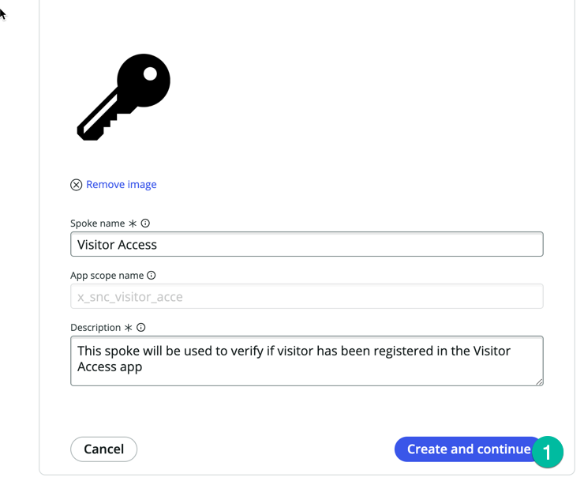
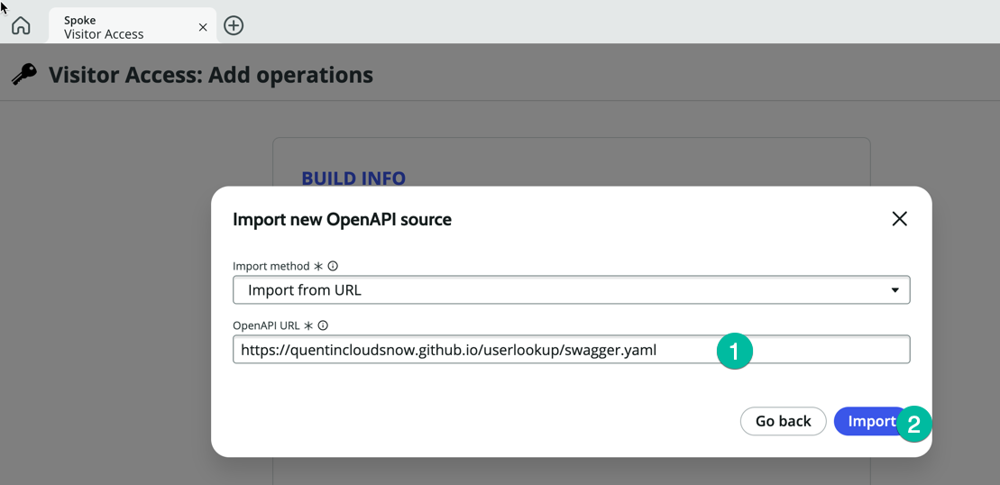
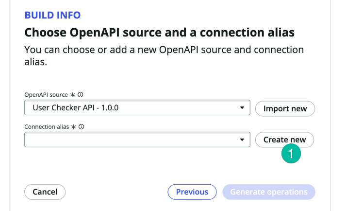
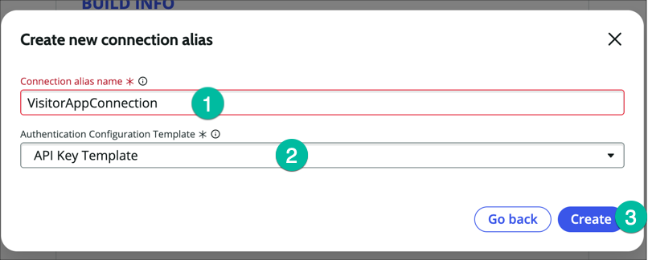
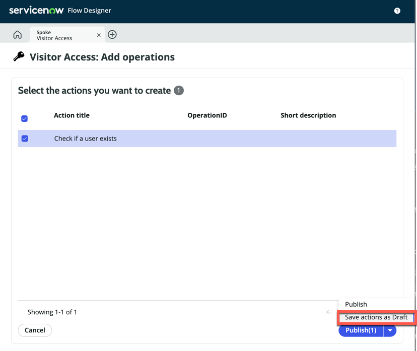
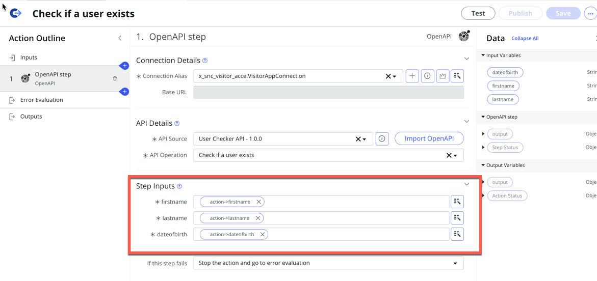

# Integration Hub Lab

## Introduction

IntegrationHub is the central place on the platform for consuming, creating, and managing integrations on your ServiceNow instance. In the event that you are seeking to connect a workflow to an external system, but ServiceNow or ServiceNow technology partners do not offer an out-of-the-box integration (Spoke) for it, you can easily create your own. IntegrationHub provides numerous Action Steps to connect your workflow to external systems that use protocols such as REST, PowerShell, SSH, etc. In this lab, we will focus on REST integration."

## Goal 

In this lab, we will highlight the new 'Spoke Generator' capability. This feature allows you to create new spokes and spoke actions for third-party APIs that comply with the OpenAPI specification. You will utilize a provided YAML file. A YAML file for OpenAPI specs is a human-readable configuration file that defines the structure, endpoints, and details of a RESTful API, making it easier for developers to document and communicate the API's design. The spoke generator can automatically leverage this YAML file to create spoke actions. This new feature accelerates the time it takes to create a new integration.

## Use case

Here's the corrected text:

ACME Inc. is using a third-party system to manage visitor access authorization to their building. This system is managed by a Security and Property Management company. ACME Inc. would like to improve the experience for visitors and their employees. ACME Inc. uses ServiceNow and would like to automate the process of verifying visitor access and badge printing using ServiceNow workflows.

There are no out-of-the-box integrations available for that Visitor Access application. As a ServiceNow builder, we need to create that integration (Spoke) so that we can query this remote system from a workflow.

In this scenario, you had a meeting with the administrator of the third-party visitor access app, who has provided you with the following API documentation: [API Documentation Link](https://quentincloudsnow.github.io/userlookup/#/default/get_checkUser). You can open the link to understand how that API works.

This is a fairly simple API. As you can see, there is only one API method, 'checkUser,' and that method requires three inputs."

| Field | type |
   |-------|-------|
   | firstname | string |
   | lastname | string |
   | dateofbirth | YYY-MM-DD |
   

By passing those user information, the API will return a message stating is a user exist or not, if the user exist, it will return additonal information that you need to use in a ServiceNow workflow, see the example of response returned by the API

 
{
  "code": "0",
  "message": "User exists",
  "user": {
    "guest_title": "Guest",
    "phone": "123-456-7890",
    "host_name": "Jane Smith",
    "host_id_number": "987654",
    "host_email": "jane@example.com",
    "guest_email": "john@example.com",
    "building_location": "Building A",
    "access_expiration": "2023-12-31"
          }
}

In the JSON response, you will receive a 'code' indicating success (0), a 'message' stating that the user exists, and detailed 'user' information including guest title, phone number, host name, host ID number, email addresses, building location, and access expiration date. If the user does not exist you will receive a code 1.

## Create the spoke

Log in to your instance, then, on the main page, click **All** (1). Next, type **flow** (2) and click **Flow Designer** (3) to open the Flow Designer UI.

Once you are in the **Flow Designer** UI, to access the Spoke Generator, select **Create New** (1) (located on the right-hand side of the screen), and then click on **Spoke**.

The Spoke Generator ask you for an thumbnail Image (1)  (You can upload a thumbnail image to be your Spoke logo (feel free to find a free image on google image and upload it here), Spoke Name (2) and a Description (4)

| Field | Value |
   |-------|-------|
   | Spoke Name | Visitor Access |
   | App Scope Name | This field is generated automatically from the Spoke Name |
   | Description | This spoke will be used to verify if visitor has been registered in the Visitor Access app |

Once you have set the value, click Create and Continue (1) as shown below:

   

On the next screen, you will be prompted to choose the method you want to use to create your new spoke. We want to use the OpenAPI Specification method since we have been provided with the YAML File that describes the API and complies with the OPENAPI Specification.

Select **OpenAPI Specification** (1) then click **Continue** (2)

On the next screen, **Visitor Access: Add operations**, this is where you can provide the YAML file. Click **Import New** (1), and then provide the url to the  YAML file, copy URL from the link here [Swagger YAML File](https://quentincloudsnow.github.io/userlookup/swagger.yaml).

Past the URL copied in your clipboard in the previous step, the past it in the **OpenAPI URL** field (1), then click **Import** (2) 

Once the import is done you should see someting similar to this 

Then click on **Create New** next to the **Connection Alias field** (1) 

> In ServiceNow, a Connection Alias is a configuration setting used to define and manage external system connections. It serves as an abstraction layer for connecting to external systems and simplifies the process of integrating with those systems within ServiceNow workflows and other components. Typically when your connect ServiceNow to an external system, you need to configure the URL of the end-point (3rd party system) and how to authenticate with it. We do this using Connection and Credentials in ServiceNow, In real life obviously a conversation with the admin of the remote system needs to happen and also with the security team before starting to configure this.

In the **Connection alias name** (1) type **VisitorAppConnection** and keep the **Authentication Configuration Template** with the default value **Api Key Template** (2), then click **Create** (3)

Click **Generate operation** (1) 

The system will then prompt you to select which Spoke Action you want to create as shown below

> For this lab, we are using a very simple API created specifically for this purpose. This API has only one method, which is why only one action is displayed. In reality, most commercial applications you attempt to integrate will have tens or even hundreds of methods in their API. You will be able to select the methods you want to leverage from ServiceNow and create Spoke Actions for them.

Select the ** Check if a user exists** (1) Action then click **Publish** (2)

> Note that if you have the choice to save it as draft, which is probably what we should do in real life instead of publishing the action right away and make it available to flow developer... in the lab we just publish it right away: 

> the screenshot above is just to show you that you can Save as Draft, do not click **Save Actions as Draft**

Click the newly created Spoke Action **Check if a user exists** (1) this will open the Action editor in Flow designer so we can inspect it 

Notice the Action Input section, the Inputs for that Spoke action was created automatically 

Click the OpenAPI Step (1) 

Notice thre step inputs, they are using the Action inputs, so the values from the Action Inputs will be passed as parameters when the API Call is made to the external system.

We need to update the Connection Alias in the Connection Details section. we have precreated in this lab instance a Connection record that point to the right API End point. We are going to use this one. 

Click on the **Connection Alias field** (1) then select **VisitorAccess_ConnectionAlias** (2) 

Notice the **Base URL** field was updated and showing the URL for the API End point. Those connection alias record are tyipically managed by Security team or someone with higher privilege.

On the right hand-side notice the outputs available from the OpenAPI Step, expand the **user** (1) section as shown below:

Those are alll the values that we can retrieve from the external app and use in a ServiceNow Worlflow.

It's time to test that Spoke Action! Click on the **Test** button 

You will be prompted to enter some user information, **dateofbirth** (1), **firstname** (2), **lastname** (3) please use those values below

| Field | Value |
   |-------|-------|
   | dateofbirth | 1984-01-25|
   | firstname | Ashley |
   | lastname | Burney |

Then click **Run Test** (4)

>Note Typically those values will be passed to the action via a Worflow. we are just testing the action manually right now

Once the Action has been executed, click on **Your test has finished running. View the Action execution details** (1) to inspect the response we have received from the external system.

On the **Execution Details** page, scroll down until you see the **ouput Data** section
and click on the output detail (1)

You should see a screen similar to this. Notic the response returned by the API. it contains the return code, message and additional user information. Our new Spoke Action works!

Now let's use from a flow! 

Click on the Home button to return to the main page of flow designer

In the following steps, we just want to show a builder can consume/use the new Spoke Action that we have created. 

Click on **Create New** (1) then **Subflow** (2)

Enter a **Subflow name** (put the name you want) and click **submit** (leave all other field with default values)

> Note: typicalla a builder would create a new flow or subflow in his own Application Scope, but for that quick test in a lab intance it does not matter we can save in the Global scope.

A new tab will open for your new subflow, under **ACTIONS** Click **Add an Action, Flow Logic or Subflow** (1)

Select Action then type **Visit**, this should display your new spoke **Visitor Access** (2), click on it then click the action **Check if a useer exists** (3)

Now we can pass the value to the action, here we are going to hardcode values just for test purpose, typically we would lookup a record in servicenow and pass values from that record to the action. We will cover that in detail in the optional section of the lab.

| Field | Value |
   |-------|-------|
   | dateofbirth | 1984-01-25|
   | firstname | Ashley |
   | lastname | Burney |

Using the values from the table above, set the **dateofbirth** (1). **firstname** (2). **lastname** (3) then click **Done** (4) and click the **Test** button.

then click **Run Test** (1) 

Click **Your Test has finished running, View the subflow exectution details** 

We have seen in this lab how to create a new Spoke using the spoke generator, to integrate ServiceNow with an external application that have an API we can use.  In the optional section of this lab we are going to cover some more advanced concepts of flow designer/Ihub and use the value retrieved from the spoke action to update a record in ServiceNow.

##Optional section

